```mermaid
gantt
	dateFormat X
	axisFormat %s
	section Window
		Sent (0~1023):0,1023
		Usable (1024~2047):1024,2047

```

```mermaid
gantt
	dateFormat X
	axisFormat %s
	section Window
		Sent (0~2047):0,2047
		Usable (None):2047,2047

```

```mermaid
gantt
	dateFormat X
	axisFormat %s
	section Window
		Sent (1000~2047):1000,2047
		Usable (2048,3047):2048,3047

```

```mermaid
gantt
	dateFormat X
	axisFormat %s
	section Window
		Sent (1000~2897):1000,2897
		Usable (2898,3047):2898,3047

```

<!--
20260527

 若学生多次提交作业，成绩计算请以评分规则为准

作业内容我的作业

是否计入总成绩 

否

公布成绩时间 不公布活动时间 结束于2026.06.03 23:59作业形式 个人作业计分规则 最后一次给分完成指标 提交作业

评分方式(教师评阅 100.0%)

 教师评阅占成绩比例 100.0%

作业说明

P256 习题5-37

P257 习题5-49

P258 习题5-61

-->
# 5-37
- Slow Start: Probes network congestion by exponentially increasing the congestion window cwnd (starting from 1–4 MSS segments). Its goal is to discover the current network condition safely without causing congestion.
- Congestion Avoidance: Maintains the `cwnd` in the linear “slow-start threshold” region (when $\text{cwnd} \ge \text{ssthresh}$). Its goal is to keep the network near the optimal throughput point (no packet loss) while still increasing `cwnd` slowly.
- Fast Retransmit: Immediately retransmits a lost segment upon receiving 3 duplicate ACKs (without waiting for timeout). It detects loss before the retransmission timer expires.
- Fast Recovery: On 3 duplicate ACKs, it sets $\text{ssthresh} = \frac{\text{cwnd}}{2}$, $\text{cwnd} = \text{ssthresh} + 3 \times MSS$ (or +1 in some Reno implementations), and switches to linear increase. It exits back to Congestion Avoidance when a new ACK arrives. It avoids unnecessary back-off from a single loss.

MD is used when congestion is detected (timeout) or after fast retransmit: $\text{ssthresh} = \frac{\text{cwnd}}{2}$, `cwnd` = 1 (or `ssthresh`).
AI is used in the Congestion Avoidance phase: `cwnd += MSS` (or +1 segment) per RTT.

# 5-49
## (1)
52100

## (2)
13

## (3)
28B

## (4)
28 - 8 = 20B

## (5)
C -> S

## (6)
Daytime

# 5-61
## (1)

## (2)

## (3)

## (4)

## (5)

## (6)

```mermaid
gantt
	dateFormat X
	axisFormat %s
	section Window
		Sent (2048~2897):2048,2897
		Usable (2898,4094):2898,4094

```

## (7)

```mermaid
gantt
	dateFormat X
	axisFormat %s
	section Window
		Sent (2048~3071):2048,3071
		Usable (3072,4094):3072,4094

```

## (8)

```mermaid
gantt
	dateFormat X
	axisFormat %s
	section Window
		Sent (None):3072,3072
		Usable (3072,5119):3072,5119

```

