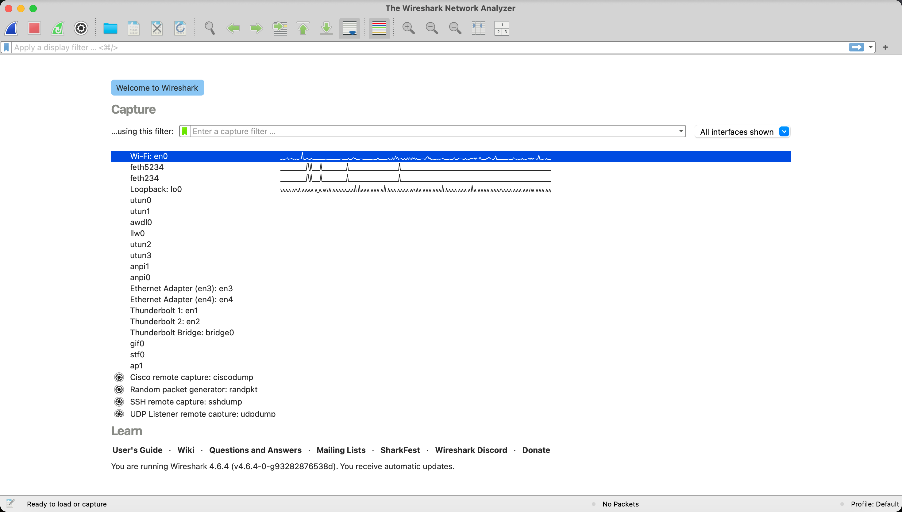
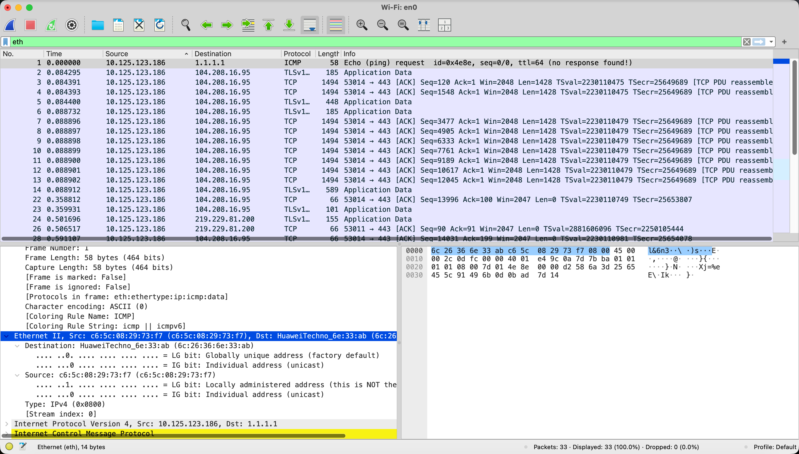
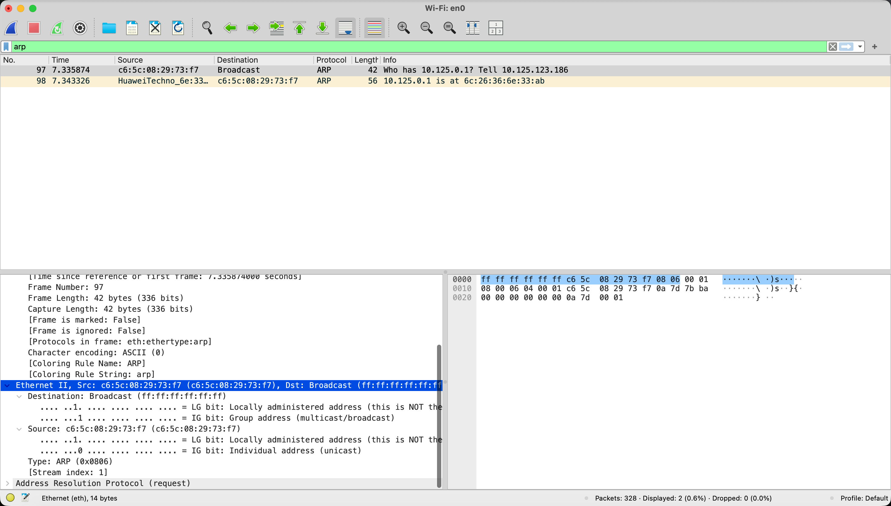
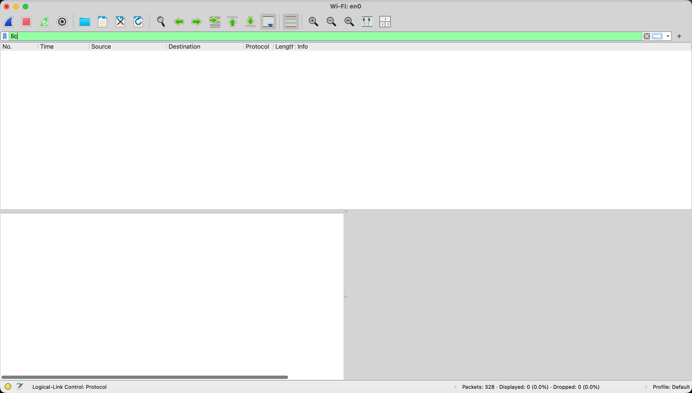

<!--
实验1：捕获观察并分析帧结构
熟悉Wireshark的基本使用
捕获与分析Ethernet II以太帧格式
捕获任意Ethernet II帧并分析其内容，注意对比和课本介绍的帧格式的差别
观察并分析Ethernet II中的数据填充情况
捕获与分析IEEE 802.3帧格式（可选）
捕获任意Ethernet II帧并分析其内容
比较Ethernet II以太帧格式和IEEE 802.3帧格式的区别与联系

关于实验的提交（1）
要求采用电子版方式提交。
上传ftp
IP地址：121.192.180.215
用户名：cognetup
口　令：cognet123up
提交的文件名规则：    <学号>_<实验号>.rar如，学号为315xxxxxxxx001，实验号为1，则提交文件应命名为：    315xxxxxxxx001_1.rar

关于实验的提交（2）
实验报告格式
一、实验名称
二、实验任务
三、实验环境及工具
四、实验记录与结果分析
五、遇到的问题与解决
-->
# Report 1
## 1. Experiment Name
Capture, Observe and Analyze Frame Structure

## 2. Experiment Tasks
1. Familiarize with the basic usage of Wireshark
2. Capture and analyze the Ethernet II frame format
    1. Capture any Ethernet II frame and analyze its content, noting the differences compared to the frame format introduced in the textbook
    2. Observe and analyze the data padding in Ethernet II
3. Capture and analyze the IEEE 802.3 frame format (optional)
    1. Capture any IEEE 802.3 frame and analyze its content.
    2. Compare the differences and connections between the Ethernet II frame format and the IEEE 802.3 frame format

## 3. Experiment Environment and Tools
- M4 MacBook Air
- Wireshark Version 4.6.4 (v4.6.4-0-g93282876538d).

## 4. Experiment Records and Result Analysis
### 4.1 Records
1. Open Wireshark and start capturing packets on the desired network interface (en0)
    
2. Press red button on the top left corner to stop capturing packets; then add a filter `eth` to display only Ethernet II frames; click on any packet to view its details
    
3. To create some data padding, open terminal and `sudo arp -d -a` to clear ARP cache; then `ping 192.168.1.1` to generate ARP request packets; add a filter `arp` to display only ARP packets; click on any ARP request packet to view its details
    
4. To capture IEEE 802.3 frames, add a filter `llc` to display only IEEE 802.3 frames
    

### 4.2 Analysis
1. Analysis of Ethernet II Frame
    - Destination: HuaweiTechno_6e:33:ab (6c:26:36:6e:33:ab)
    - Source: c6:5c:08:29:73:f7 (c6:5c:08:29:73:f7)
    - Type: IPv4 (0x0800)

    In the Packet Bytes pane, the first 14 bytes exactly match the Ethernet II header format (6 bytes Destination + 6 bytes Source + 2 bytes Type). This is completely consistent with the textbook description of Ethernet II frame format. The only minor difference is that Wireshark does not display the FCS (Frame Check Sequence) field because it is handled by the network interface hardware.
2. Analysis of Data Padding in Ethernet II
    ARP request packets have a total length of 28 bytes, which is less than the minimum Ethernet II frame size of 64 bytes. Therefore, Ethernet II frames with ARP requests will have data padding to meet the minimum frame size requirement. But in Wireshark, the data padding is not explicitly shown.
3. Analysis of IEEE 802.3 Frame
    IEEE 802.3 is an older Ethernet standard that uses a different frame format compared to Ethernet II, and is very rarely used in modern networks. So there is no content after applying the `llc` filter.
4. Comparison of Ethernet II and IEEE 802.3 Frame Formats
    - Bytes 13–14: Ethernet II uses Type field (> 0x0600); IEEE 802.3 uses Length field (<= 0x05DC). This is the key difference to distinguish the two formats.
    - Following fields: Ethernet II carries upper-layer protocol directly; IEEE 802.3 adds LLC + SNAP header (8 extra bytes).
    - Maximum payload: 1500 bytes (Ethernet II) vs. 1492 bytes (IEEE 802.3).
    - Minimum data field: Both require 46 bytes (padding added if needed).

## 5. Problems Encountered and Solutions
### 5.1 Problems
1. The capture was performed on the wireless interface (en0). It was expected to show 802.11 frames, but only Ethernet II frames appeared.
2. Even after clearing the ARP cache and sending `ping` to generate ARP request packets, the “Padding” field was not explicitly displayed in Wireshark.

### 5.2 Solutions
1. According to Wireshark official documentation and macOS Wi-Fi driver behavior, the wireless interface in normal mode automatically translates 802.11 frames into pseudo-Ethernet II headers for compatibility with upper-layer protocol analysis. This is standard behavior and does not affect the experiment results. If want to capture raw 802.11 frames, configure Wireshark to make the wireless interface work in monitor mode, but this is not required for this experiment.
2. On macOS Wi-Fi (en0) captures, the driver translates 802.11 frames into pseudo-Ethernet II format. Padding bytes required by the Ethernet minimum frame length (64 bytes) are handled at the driver/hardware level and are often not dissected or labeled by Wireshark. This is a known limitation of wireless capture environments (on wired Ethernet interfaces, the “Padding” field is usually explicitly shown). The minimum frame length rule still applies in practice.
