<!--
任务一

1. 建立简单拓扑图；
(a)

一台服务器 
一台 2960 交换机 
一台 1841 路由器 
一台集线器 
一部 IP 电话 
一台 PC 
使用自动连接方式连接设备
70F5868B7577864DD78EF93979D65C8C.jpg

(b)

编辑

数据库服务器

网络信息中心

网管工作站

Web服务器

光缆

双绞线

防火墙

光缆

路由器

万兆
交换机

光缆

双绞线

光缆

光缆

光缆

双绞线

千兆
交换机

百兆
交换机

E1552D13CD374FD0E11FAAB9DD36A2F6.jpg

任务二

1. 利用一台型号为2960的交换机将2台pc机互联组件一个小型局域网；
2. 分别设置pc机的IP地址；
3. 验证pc机间可以互通。

817A27A1409B55E5ED56F864AF92A5A6.jpg

任务三

1.  利用一台路由器，两台交换机和3台pc、1台笔记本，建立一个网络；
2. 分别设置pc机的IP地址；
3.验证pc机间可以互通。

6AAD72CDB6205753BE49E68DB75E434A.png
-->
# Report 3
## 1. Experiment Name
Network Topology Design and Configuration

## 2. Experiment Tasks
### Task 1
#### (a)
Establish a simple topology diagram:
- A server
- A 2960 switch
- A 1841 router
- A hub
- An IP phone
- A PC
Use automatic connection to connect the devices.
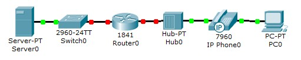

#### (b)
Edit
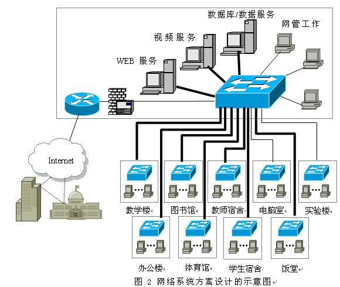

### Task 2
1. Use a 2960 switch to interconnect two PCs to form a small local area
2. Set the IP addresses of the PCs respectively
3. Verify that the PCs can communicate with each other

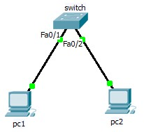

### Task 3
1. Use a router, two switches, three PCs, and one laptop to establish a network
2. Set the IP addresses of the PCs respectively
3. Verify that the PCs can communicate with each other

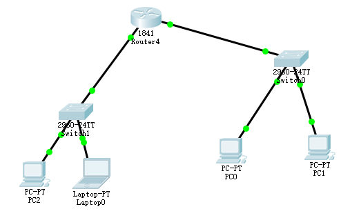

## 3. Experiment Environment and Tools
- M4 MacBook Air
- Cisco Packet Tracer (Version 9.0.0.0810)

## 4. Experiment Records and Result Analysis
### 4.1 Records
#### Task 1
##### (a)
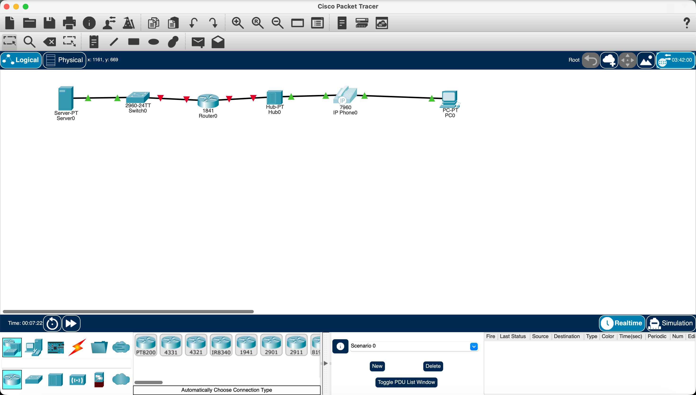

To power on the IP phone, click the IP phone, go to     `Physical` tab, and click and drag the `IP_PHONE_POWER_ADAPTER` from the right panel to the IP phone's power port.
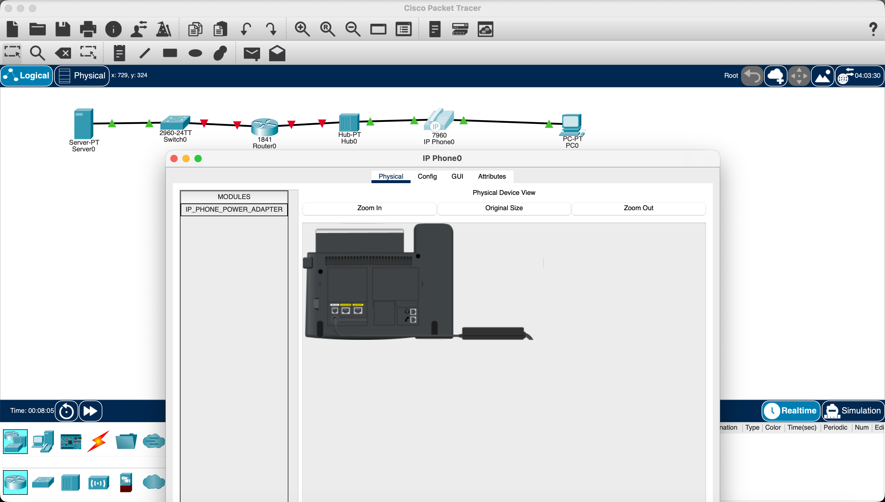

##### (b)
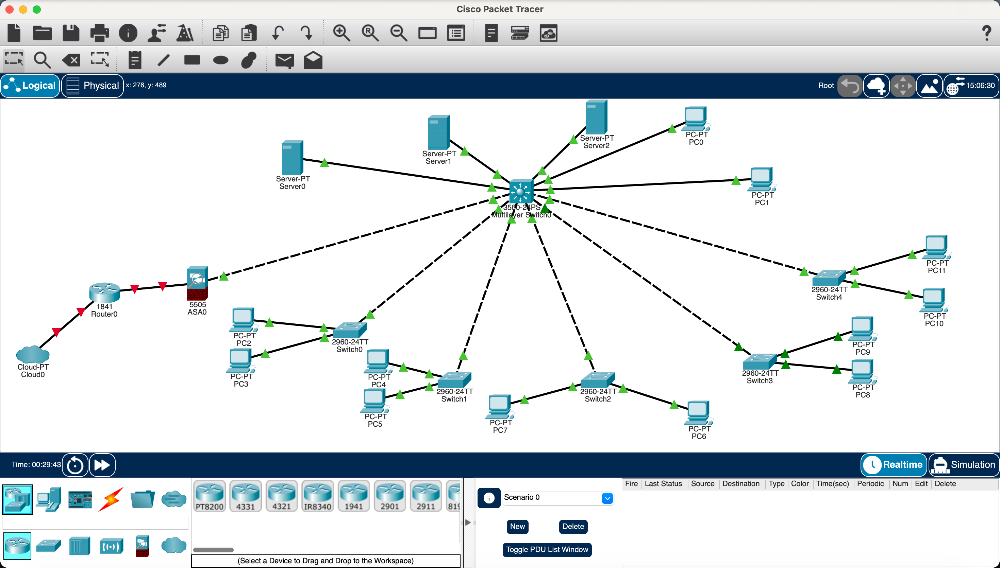

#### Task 2
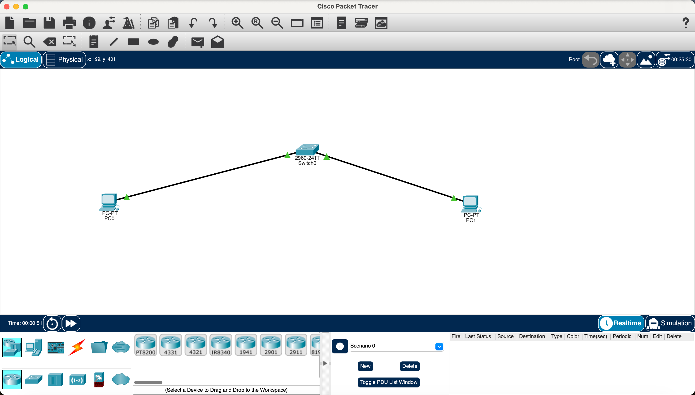

Click PC0, go to `Config` tab, go to `FastEthernet0`, set the IP address to 192.168.1.1 and subnet mask is automatically set to 255.255.255.0.
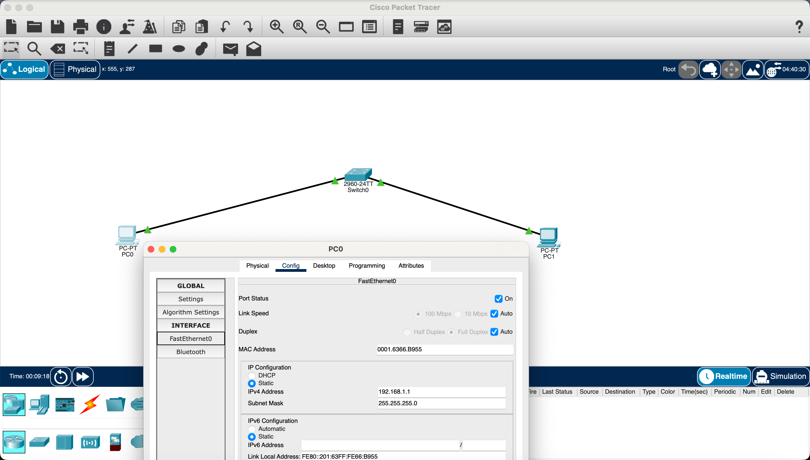

Then the same for PC1, but set the IP address to 192.168.1.2.
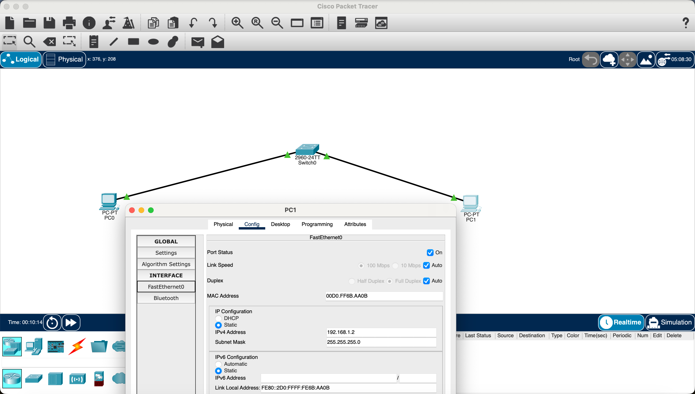

Then click PC0, go to `Desktop` tab, click on `Command Prompt`, and type `ping 192.168.1.1` to ping itself, and it is successful. Then type `ping 192.168.1.2` to ping PC1, and it is successful.
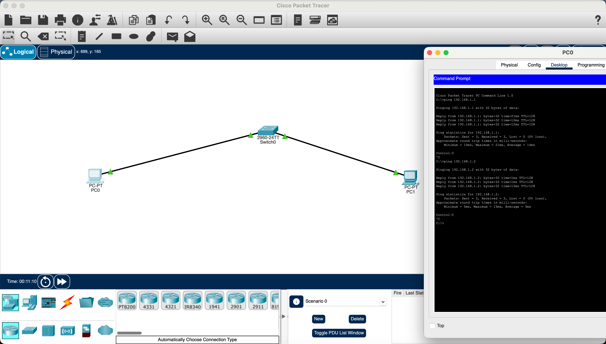

The same for PC1, ping itself and ping PC0, both are successful.
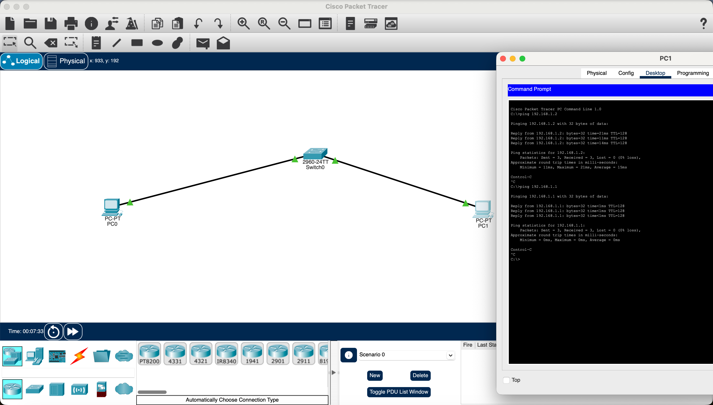

#### Task 3
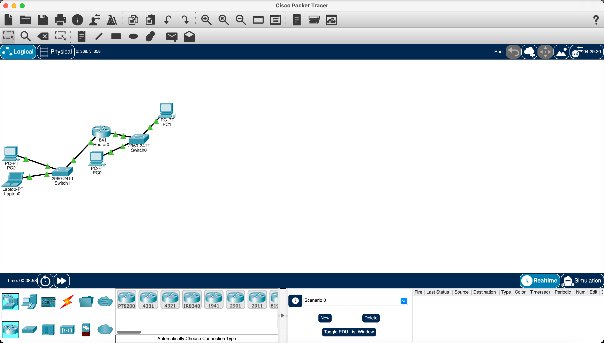

To start and configure the router, click the router, go to `CLI` tab, and enter the following commands
```bash
enable
configure terminal
interface fa0/0
ip address 192.168.1.1 255.255.255.0
no shutdown
exit
interface fa0/1
ip address 192.168.2.1 255.255.255.0
no shutdown
exit
end
```
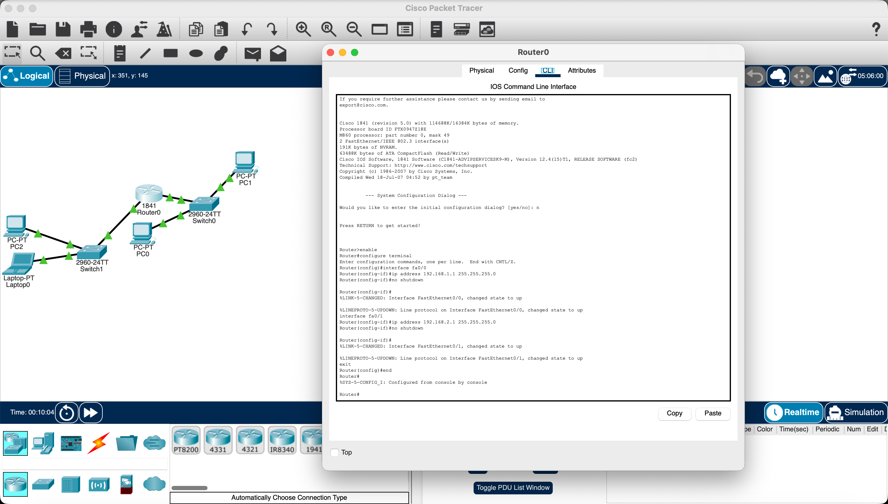

Then configure the PCs. Set PC0's and PC1's default gateway to 192.168.1.1 and their IP addresses to 192.168.1.2 and 192.168.1.2 respectively. Set PC2 and Laptop0's default gateway to 192.168.2.1 and their IP addresses to 192.168.2.2 and 192.168.2.3 respectively.
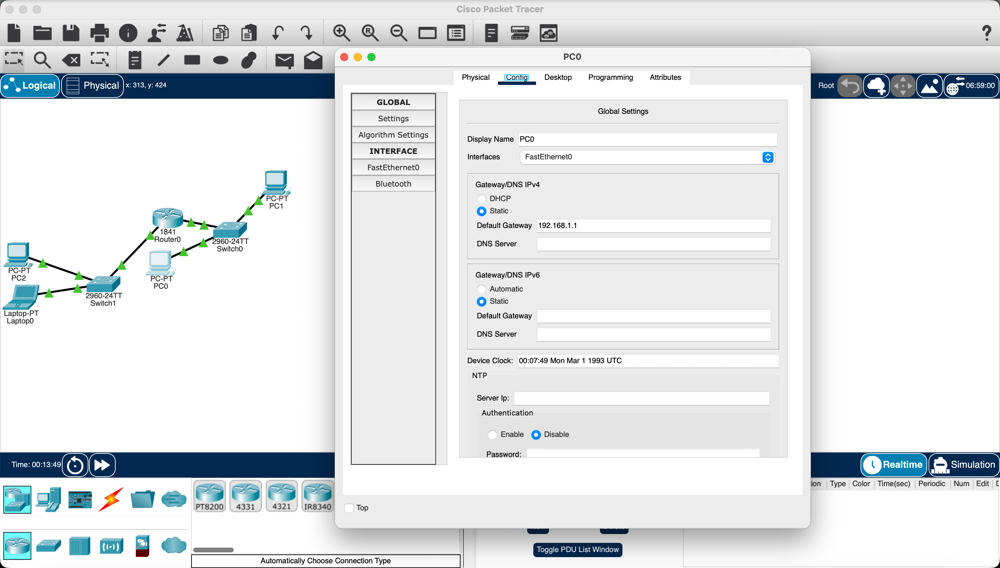
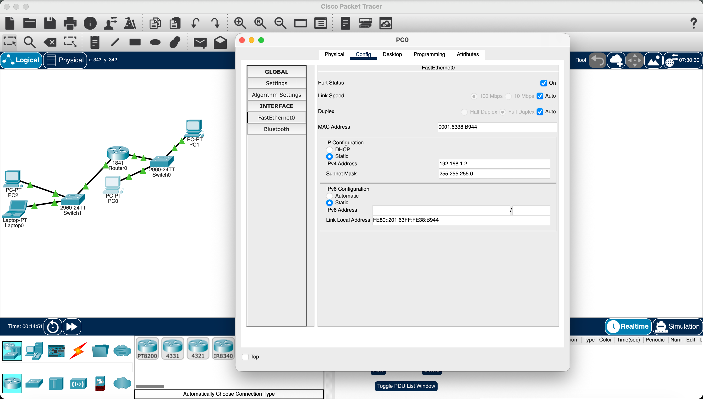

Then ping between the router, PCs and laptop to verify they can communicate with each other. First ping from PC0 to PC2, and it is successful.

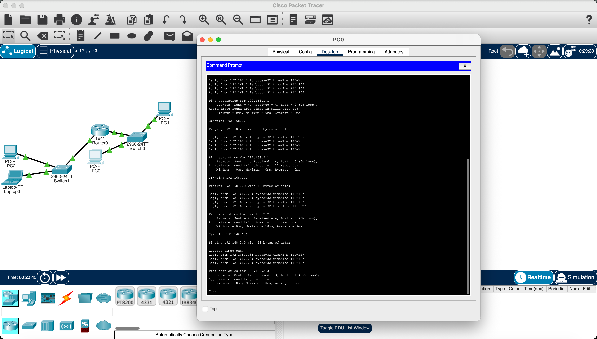

### 4.2 Analysis
#### Task 1
##### (a)
None.

##### (b)
None.

#### Task 2
None.

#### Task 3
None.

## 5. Problems Encountered and Solutions
### 5.1 Problems
#### Task 1
##### (a)
None.

##### (b)
1. Can't follow the cable types in the figure (fiber can't connect to the Serve).

#### Task 2
None.

#### Task 3
None.

### 5.2 Solutions
#### Task 1
##### (a)
None.

##### (b)
1. Use "Automatic Choose Connection Type" to connect the devices, and it will automatically choose the correct cable type.

#### Task 2
None.

#### Task 3
None.
