<!--
DB9A031887CBE5142DBA39FBA4AE050F.png
42AE29944A7844713EAF408DE029FBCC.png
9582388E7A8D95696F4B16AFBB0A81E1.png
CE4D5FA247AADE8919B46508C5541614.png
F3BF8D0FB258D45195BBE771BF52BF65.png
80B519DBDF8F4A0A8E22070290596CF2.png
072F77C8F63D823BDE5C2937336FF639.png
2FCC9D3EFA911A61D3DE4C0BACB485F7.png
6C3A9D34A677C35E7FF950559B9D2E38.png
806EA8B66F66867F2FBC50FB08133394.png
B50FE4C834AFFC832D1F5D98101F1F2C.png
FED281016BCC8D7840BECA4210B27B34.png
90C590FF0F59D51DDB3EC6907E9FA927.png
D508E02FB5544E6D18DE69D4C8AD4784.png
0D05E718798B8EA9299AB5159F57E714.png
-->
# Report 4
## 1. Experiment Name
### 10.
Static Routing

### 11.
Routing Information Protocol (RIP)

### 12.
Open Shortest Path First (OSPF)

## 2. Experiment Tasks
### 10. Static Routing
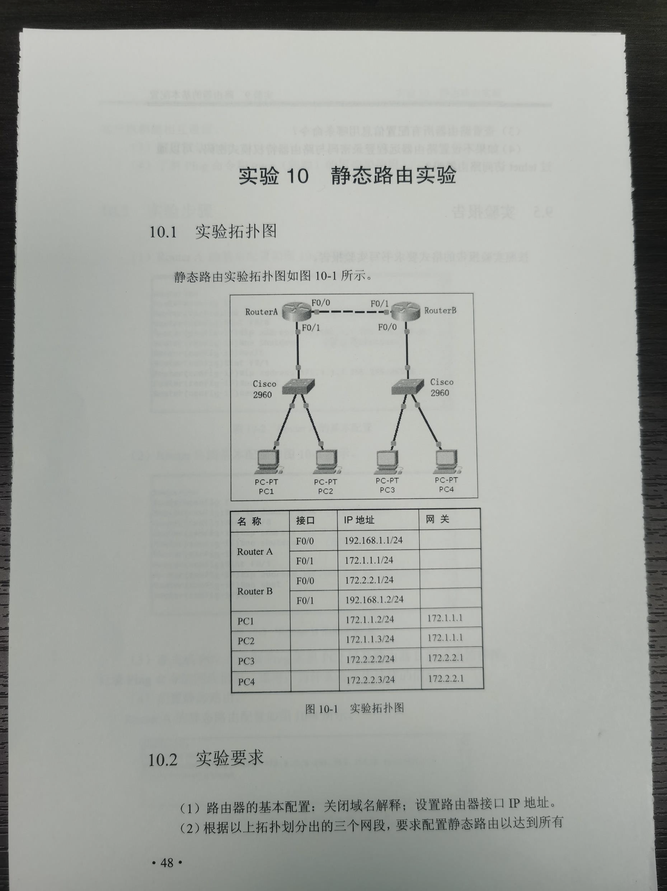
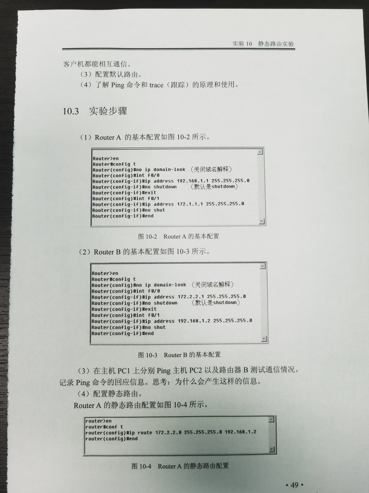

### 11. Routing Information Protocol (RIP)
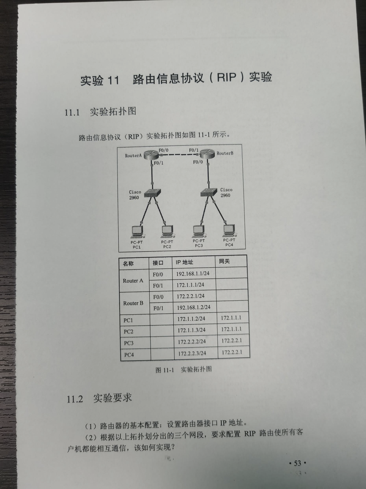

### 12. Open Shortest Path First (OSPF)
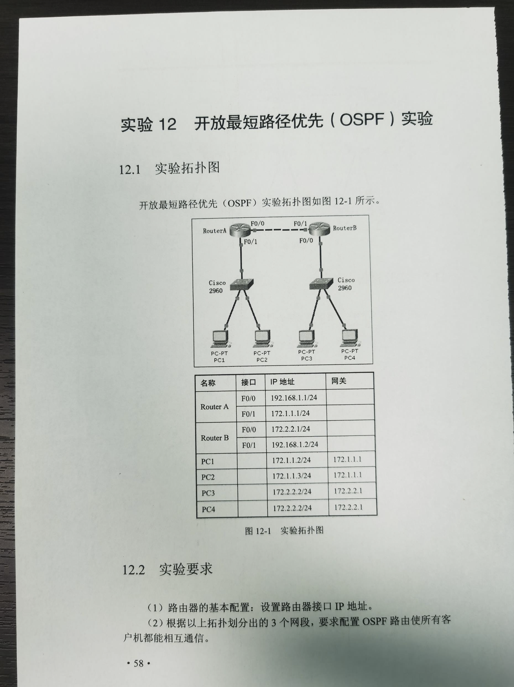

## 3. Experiment Environment and Tools
- M4 MacBook Air
- Cisco Packet Tracer (Version 9.0.0.0810)

## 4. Experiment Records and Result Analysis
### 4.1 Records
#### 10. Static Routing

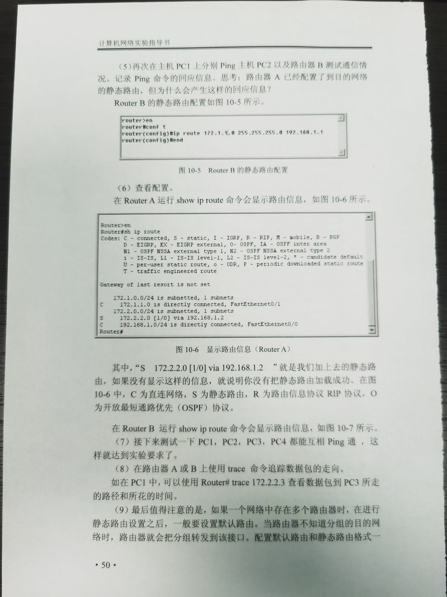
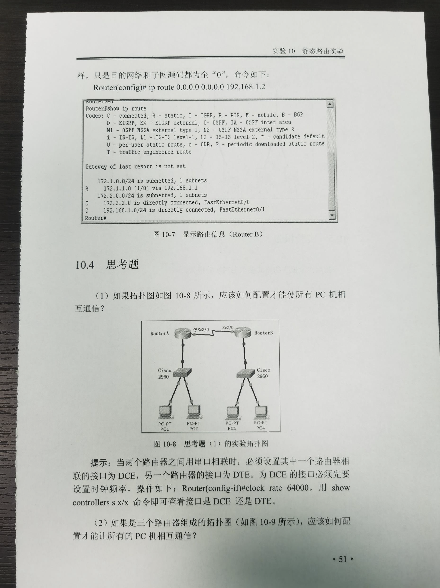

#### 11. Routing Information Protocol (RIP)
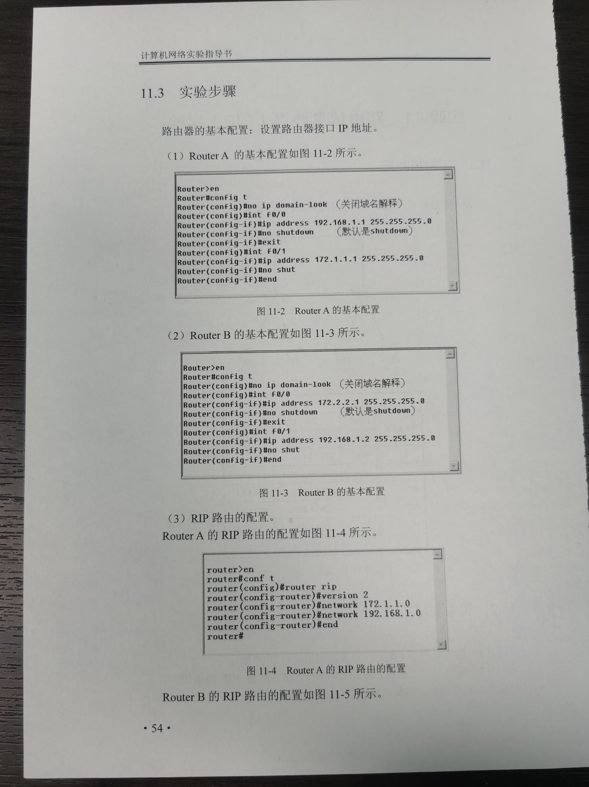
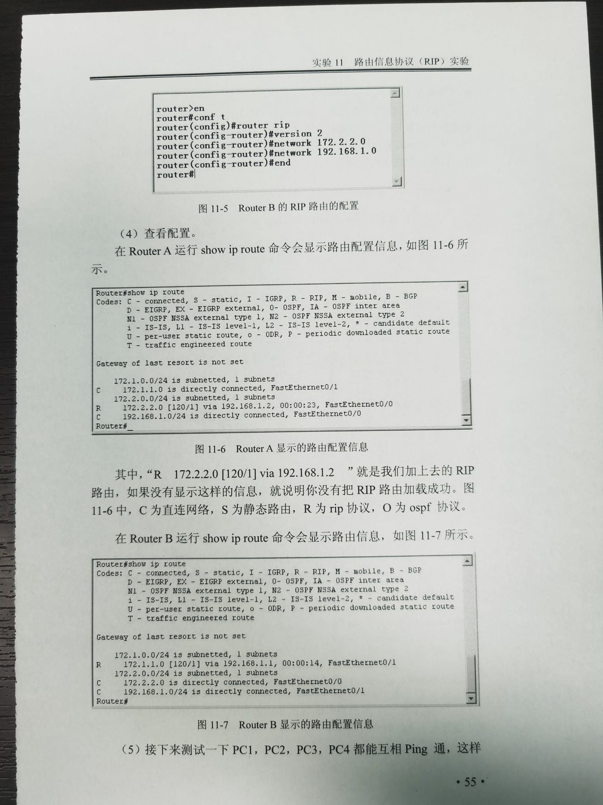
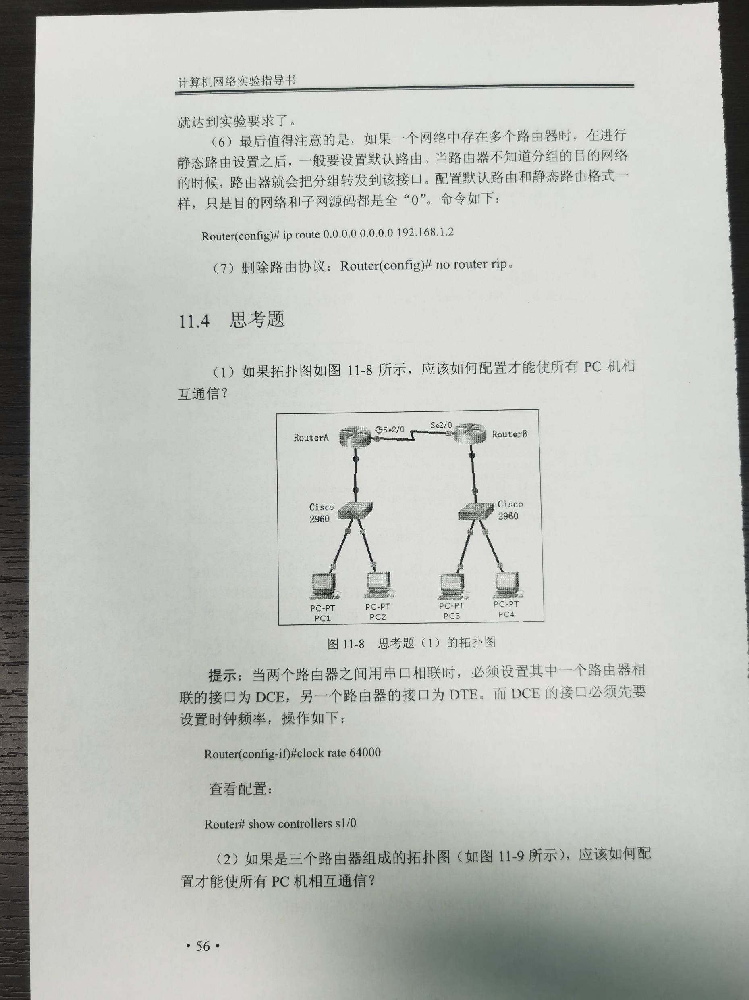

#### 12. Open Shortest Path First (OSPF)
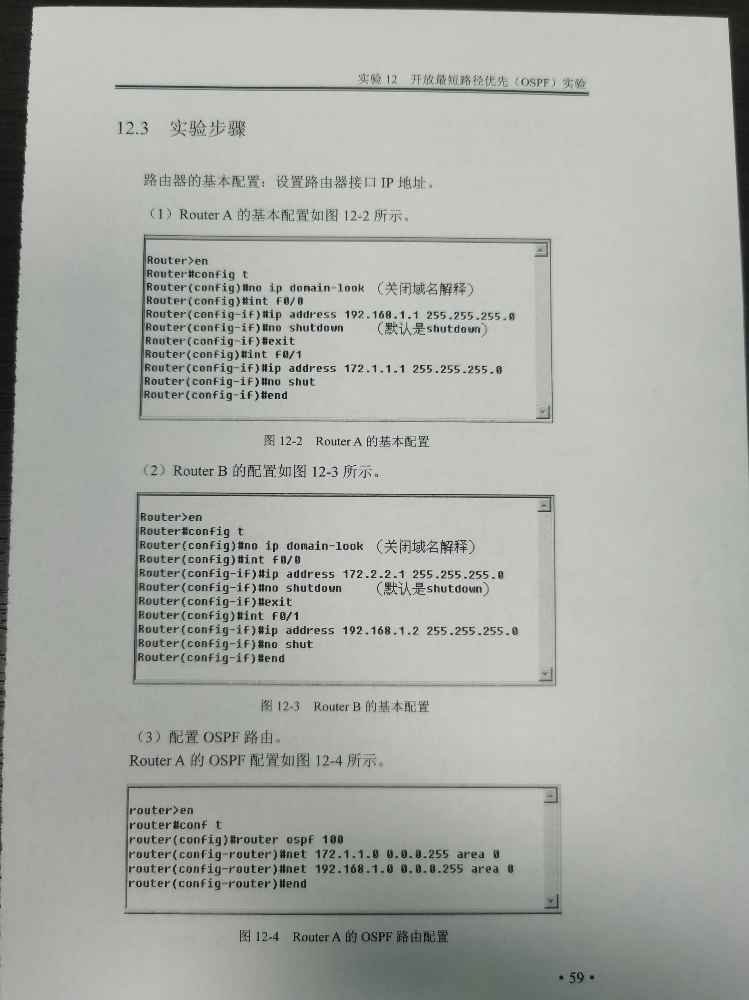
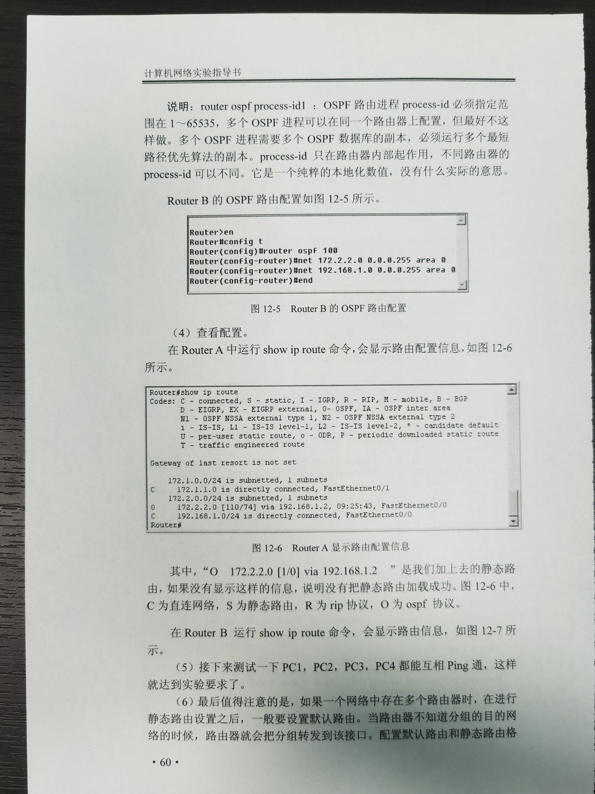
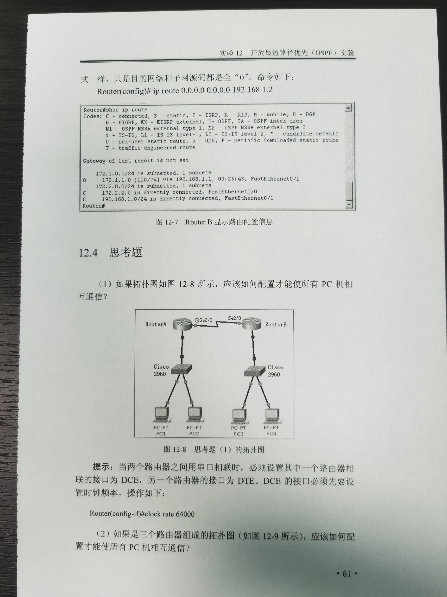

### 4.2 Analysis
#### 10. Static Routing
Before static routes were added, hosts could only communicate within their local network and with directly connected router interfaces. Although Router A and Router B each had their own directly connected networks, they did not initially know how to reach the remote LANs. Therefore, packets sent to remote networks were dropped because there was no valid route in the routing table.

After static routes were configured on both routers:
- Router A learned how to reach 172.2.2.0/24 through next hop 192.168.1.2
- Router B learned how to reach 172.1.1.0/24 through next hop 192.168.1.1

As a result, both forward and return paths were available, enabling full inter-network communication. The show ip route command confirmed that:
- C means directly connected route
- S means static route

This demonstrated the basic principle of static routing: a router forwards packets according to manually configured routes, and bidirectional communication requires valid routes in both directions.

#### 11. Routing Information Protocol (RIP)
RIP is a distance-vector routing protocol. After RIP was enabled on both routers, each router automatically exchanged routing information with the other router through the shared network 192.168.1.0/24. Once the routing update was completed, each router learned the remote LAN route:
- Router A learned 172.2.2.0/24
- Router B learned 172.1.1.0/24

The show ip route command displayed routes marked with R, which indicates RIP-learned routes. This showed that dynamic routing can reduce manual configuration effort compared with static routing, and route information can be automatically updated.

#### 12. Open Shortest Path First (OSPF)
OSPF is a link-state routing protocol. Compared with RIP, it converges faster and uses a more efficient shortest-path calculation. In here, both routers were configured to advertise their directly connected networks in area 0. After OSPF neighbor relationships were established, each router learned the remote LAN route automatically. The routing table showed routes marked with O, indicating OSPF-learned routes. This demonstrated that OSPF can dynamically calculate and update routes, making it suitable for larger and more complex networks than static routing.

## 5. Problems Encountered and Solutions
### 5.1 Problems
#### 10. Static Routing
None.

#### 11. Routing Information Protocol (RIP)
None.

#### 12. Open Shortest Path First (OSPF)
None.

### 5.2 Solutions
#### 10. Static Routing
None.

#### 11. Routing Information Protocol (RIP)
None.

#### 12. Open Shortest Path First (OSPF)
None.
