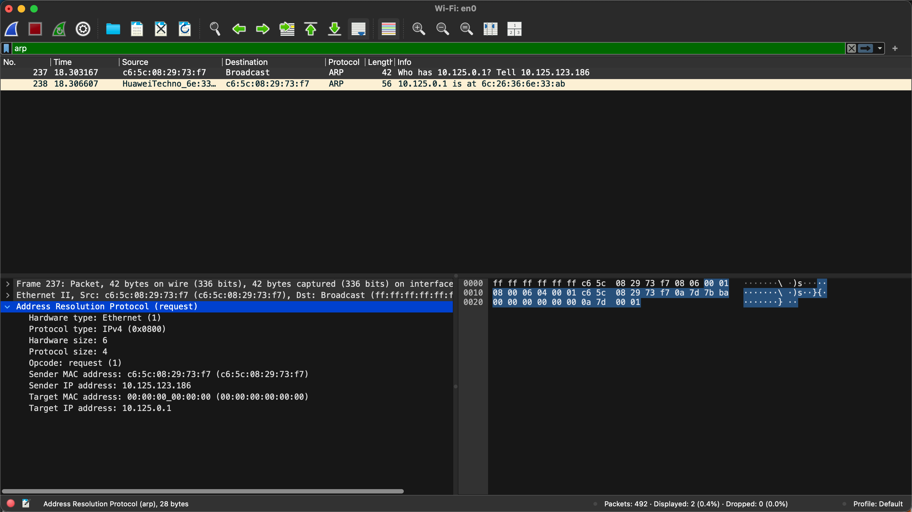
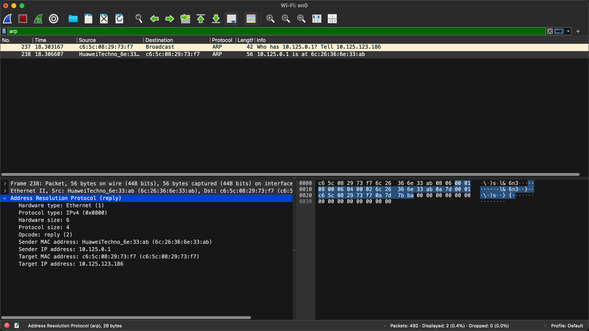
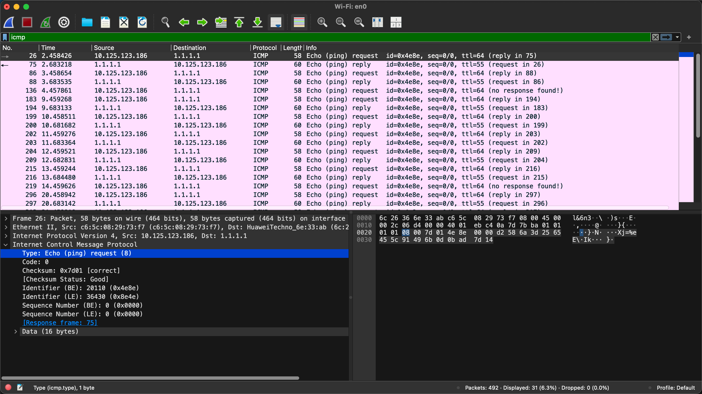
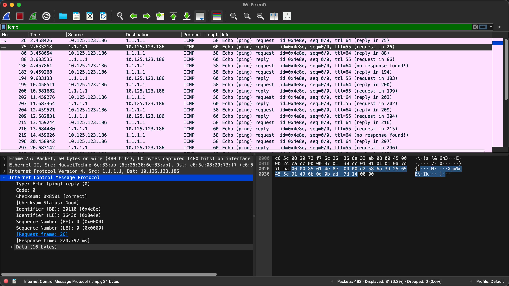
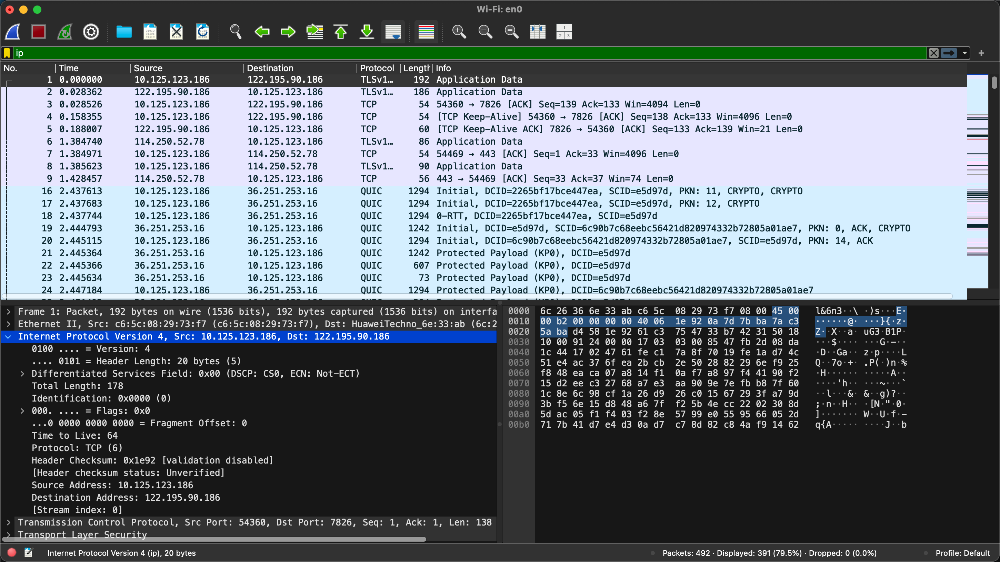

<!--
实验2：捕获并分析网络分组
学习Wireshark的过滤器使用
捕获与分析ARP报文
捕获与分析ICMP报文
捕获与分析IP报文
-->
# Report 2
## 1. Experiment Name
Capturing and Analyzing Network Packets.

## 2. Experiment Tasks
1. Learn to use Wireshark filters.
2. Capture and analyze ARP packets.
3. Capture and analyze ICMP packets.
4. Capture and analyze IP packets.

## 3. Experiment Environment and Tools
- M4 MacBook Air
- Wireshark Version 4.6.4 (v4.6.4-0-g93282876538d).

## 4. Experiment Records and Result Analysis
### 4.1 Records
1. There are 2 types of filters in Wireshark: capture filters and display filters. Capture filters are used to specify which packets to capture, while display filters are used to specify which captured packets to display. There is no need to use capture filters in this experiment, as we can capture all packets and then use display filters to analyze them. Open Wireshark and start capturing packets for a while, keep network traffic flowing.
2. Open terminal and `sudo arp -d -a` to clear ARP cache; then `ping 192.168.1.1` to generate ARP request packets; add a filter `arp` to display only ARP packets; click on any ARP request packet to view its details.
    
    
3. Add a filter `icmp` to display only ICMP packets; click on any ICMP echo request packet to view its details.
    
    
4. Add a filter `ip` to display only IP packets; click on any IP packet to view its details.
    

### 4.2 Analysis
1. ARP packets are used for mapping IP addresses to MAC addresses in a local network. The ARP request packet contains the sender's IP and MAC address, and the target's IP address, while the ARP reply packet contains the sender's IP and MAC address, and the target's IP and MAC address.
2. ICMP packets are used for network diagnostics and error reporting. The ICMP echo request packet contains the sender's IP address, the target's IP address, and a payload, while the ICMP echo reply packet contains the sender's IP address, the target's IP address, and a payload.
3. IP packets are used for routing data across networks. The IP packet contains the source IP address, the destination IP address, and a payload. The IP header also contains information such as the version, header length, total length, identification, flags, fragment offset, time to live, protocol, and header checksum.

## 5. Problems Encountered and Solutions
### 5.1 Problems
None.

### 5.2 Solutions
None.
